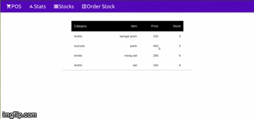
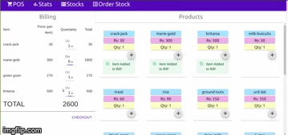
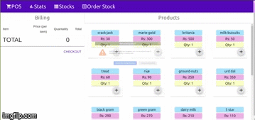

# Point Of Sale Application

## Features

* [x] stock data
* [x] statistics of stock,sale\(charts\)
* [x] items to order from vendor\(automate using stock data\)
* [x] display all items on home page
* [x] add items to cart
* [x] checkout
* [ ] add payment interface
* [ ] add notifications'
* [ ] sorting,filtering
* [ ] pagination

## Api-Back-End

### categories:

* Lentils
* Biscuits
* Milk Products
* other-add category from front end

| category | item | price | stock\(kg/items\) |
| :--- | :--- | :--- | :--- |
| Lentils | dal | 200 | 2000 |

## Overview of POS Application:

  

